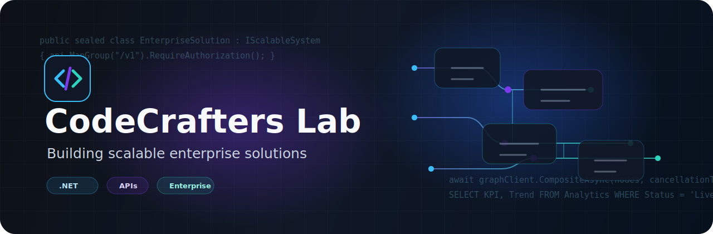

  

  

  

    <strong>Full Stack Developer specialized in .NET, enterprise APIs, SQL Server, Angular and data-driven systems.</strong>
  

  

    
    
  

---

## About Me

I’m a **Full Stack Developer** focused on building, integrating and modernizing **enterprise-grade software** using **.NET 8, C#, SQL Server and Angular**.

My work connects backend architecture, data processing, API integrations and frontend development to deliver reliable, scalable and maintainable business solutions.

- Build and maintain **REST APIs** with **ASP.NET Core / .NET 8**
- Design SQL solutions using **stored procedures, views, CTEs and performance tuning**
- Develop enterprise frontend applications with **Angular 17/18, TypeScript and PrimeNG**
- Create data workflows, **ETL processes** and business dashboards with **Power BI**
- Integrate enterprise platforms using **Salesforce Composite Graph API**
- Work with **Docker, Snyk, Git and secure development practices**
- Participate in **.NET migrations**, modernization and microservice-oriented architectures

 

---

## Tech Stack

### Backend

  
  
  
  
  

### Frontend

  
  
  
  
  

### Database & Data

  
  
  
  
  

### Enterprise Integrations & Tools

  
  
  
  
  
  
  

---

## GitHub Analytics

  

  

    

  

---

## Featured Projects

<table>
  <tr>
    <td width="50%">
      <h3>Enterprise REST API Platform</h3>
      
Scalable backend API architecture for business workflows, authentication, SQL operations and service-based integrations.

      

        
        
        
      

    </td>
    <td width="50%">
      <h3>Salesforce Composite Graph Integration</h3>
      
Enterprise integration layer using Salesforce Composite Graph API with batch processing, concurrency handling, error tracking and structured logs.

      

        
        
        
      

    </td>
  </tr>
  <tr>
    <td width="50%">
      <h3>Power BI Business Dashboards</h3>
      
Data models and dashboards focused on operational visibility, KPIs, executive reporting and decision support.

      

        
        
        
      

    </td>
    <td width="50%">
      <h3>Angular Enterprise UI</h3>
      
Modern frontend applications with reusable components, responsive layouts and API-driven business workflows.

      

        
        
        
      

    </td>
  </tr>
</table>

---

## What I’m Working On

- Migrating and modernizing enterprise applications to **.NET 8**
- Improving **SQL Server performance** through query optimization and better data modeling
- Building secure and scalable **REST APIs**
- Designing reliable **Salesforce integrations** for complex business processes
- Creating **Power BI dashboards** connected to real operational data
- Strengthening code quality with **Docker, Snyk and secure development workflows**

---

## Dev Focus

  

---

## Contact

  
  

---

  <strong>Building scalable enterprise systems with clean architecture, reliable APIs and data-driven decisions.</strong>

    

  

