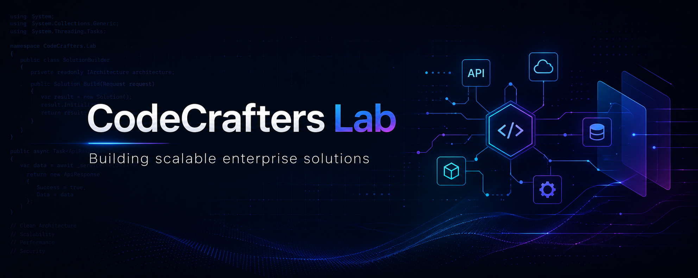



  

  <h1>CodeCrafters Lab</h1>

  

    <strong>Building scalable enterprise solutions with modern software architecture, secure APIs, cloud-ready systems and data-driven platforms.</strong>
  

  

    
    
    
    
  

---

## Who We Are

**CodeCrafters Lab** is a software engineering lab focused on designing, building and modernizing enterprise-grade systems.

We specialize in backend platforms, API integrations, business dashboards, data workflows and modern frontend applications built for scalability, maintainability and long-term evolution.

- Enterprise web applications and internal business platforms
- Secure REST APIs and service-oriented architectures
- SQL Server optimization, reporting and data modeling
- Angular applications with clean, scalable UI architecture
- Power BI dashboards and operational analytics
- Docker-ready deployments, security scanning and modernization workflows

---

## Core Expertise

<table>
  <tr>
    <td width="50%">
      <h3>Backend Engineering</h3>
      
Robust APIs, business logic, authentication flows, data access layers and service integrations using .NET and C#.

      

        
        
        
      

    </td>
    <td width="50%">
      <h3>Frontend Platforms</h3>
      
Modern Angular interfaces designed for business workflows, dashboards, forms, admin tools and enterprise operations.

      

        
        
        
      

    </td>
  </tr>
  <tr>
    <td width="50%">
      <h3>Data & Analytics</h3>
      
SQL Server solutions, ETL processes, Power BI dashboards and business intelligence systems for operational visibility.

      

        
        
        
      

    </td>
    <td width="50%">
      <h3>Enterprise Integrations</h3>
      

        
        
      

    </td>
  </tr>
</table>

---

## Technology Stack

  
  
  
  
  
  
  
  
  

---

## What We Build

- **Enterprise APIs** for internal platforms, business workflows and system integrations
- **Angular dashboards** for operations, administration and reporting
- **SQL Server solutions** with stored procedures, views, CTEs and optimized queries
- **Power BI dashboards** for KPIs, performance tracking and executive visibility
- **Salesforce integrations** with Composite Graph API, batching and error control
- **Modernization projects** for .NET upgrades, architecture improvements and security hardening

---

## Engineering Principles

  
  
  
  
  

We care about maintainable code, clear boundaries, reliable integrations, measurable business value and systems that can grow with the organization.

---

## Repository Focus

This organization hosts projects related to:

- Backend APIs and .NET services
- Angular web applications
- SQL Server and reporting solutions
- Integration services and automation workflows
- Enterprise modernization experiments
- Internal tools and reusable engineering assets

---

## Contact

  
  

---

  <strong>CodeCrafters Lab</strong>
   
  Building scalable enterprise solutions.

